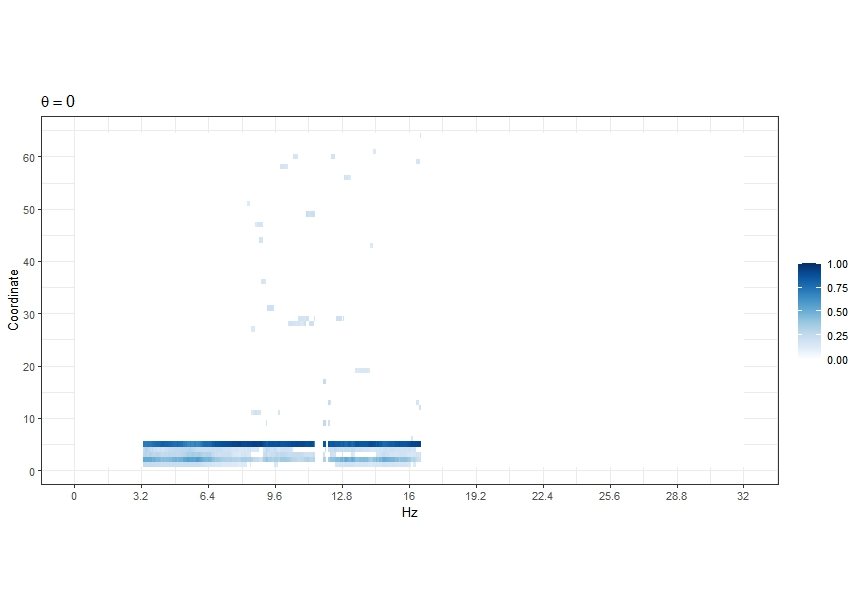
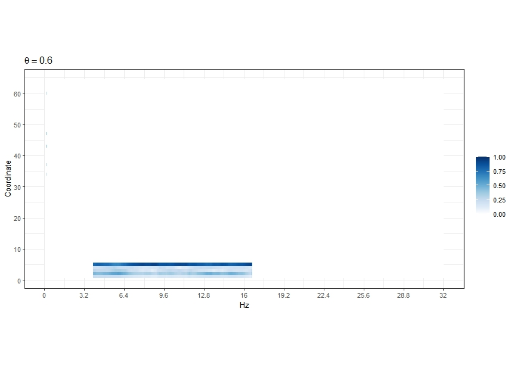
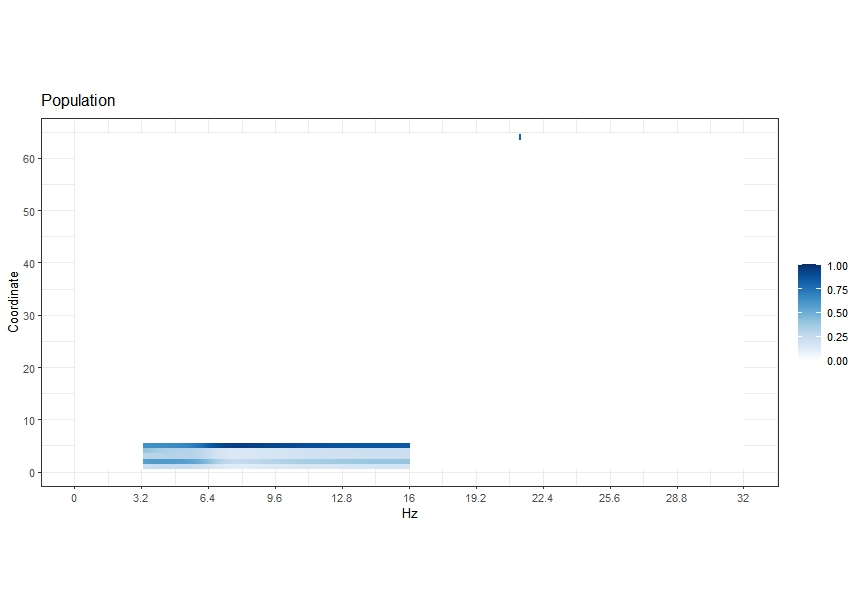
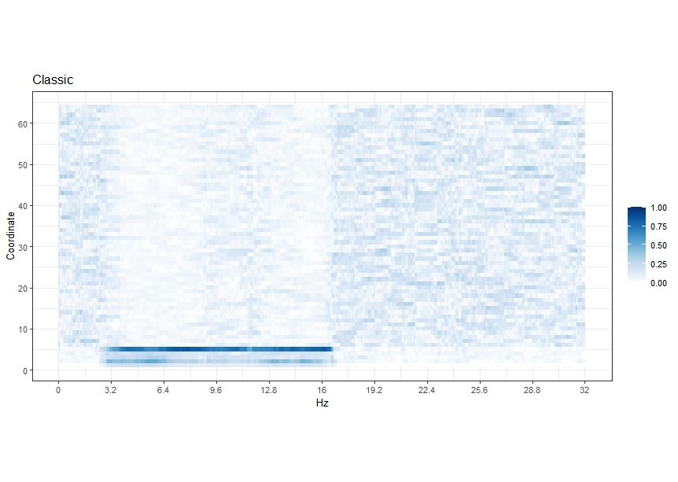
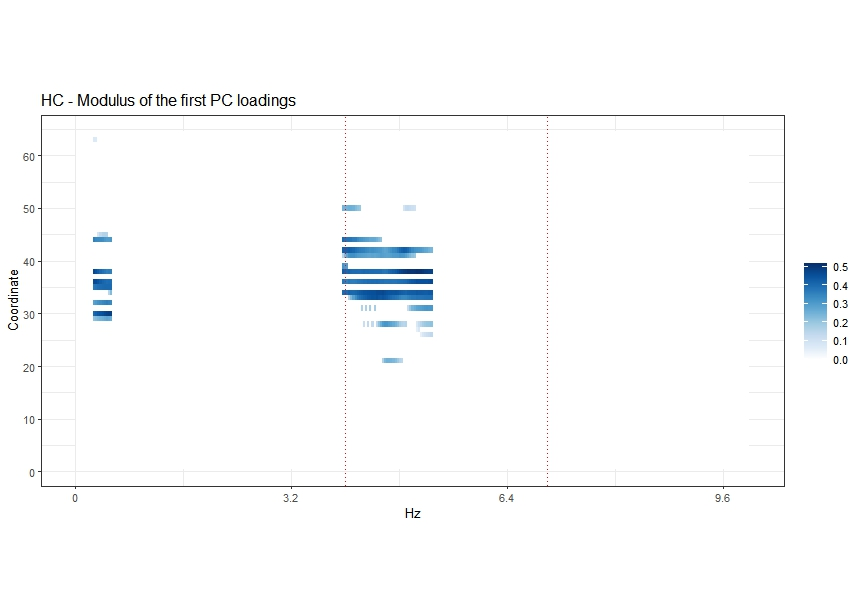
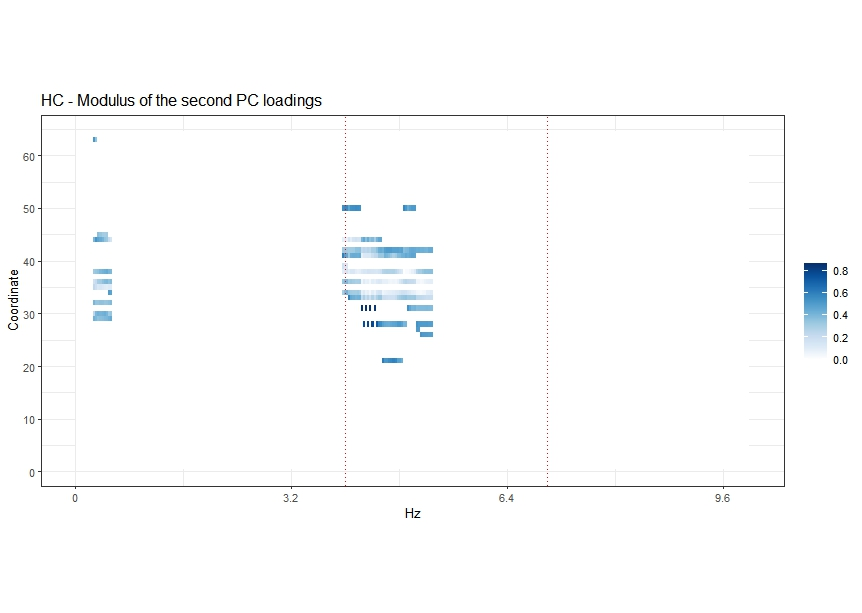
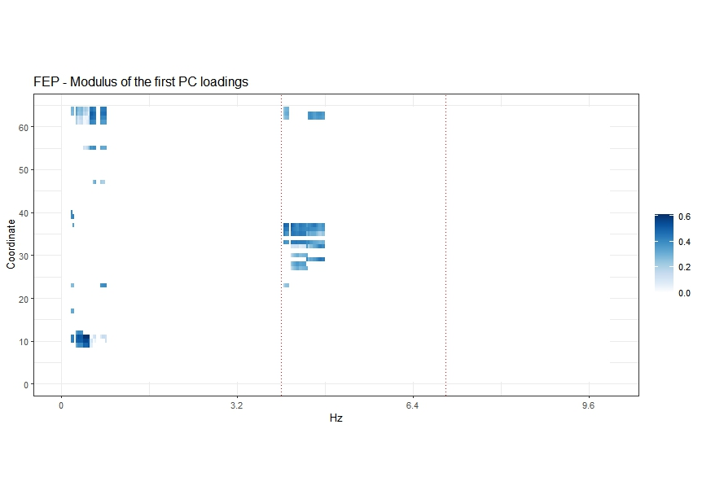
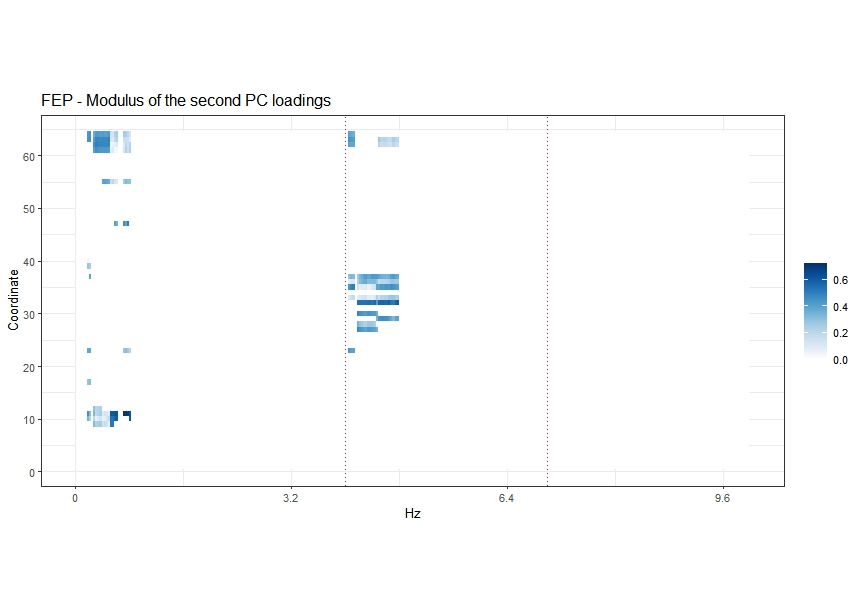

# lspca

`lspca` is an R-package that provides an implementation of the localized and sparse principal components of multivariate time series in the frequency domain. The algorithm is based on the paper
[Localized Sparse Principal Component Analysis in Frequency Domain](https://arxiv.org/abs/2408.08177#)
by Jamshid Namdari, Amita Manatunga,Fabio Ferrarelli, and Robert Krafty. 

In order to perform the localized and sparse principal component analysis in the frequency domain, users have two options. They can either use the function `LSPCA` and pass the time domain recording of the time series or they can use the function `LSPCA.f` and pass an estimate of the spectral density matrices.

## Installation

The `lspca` can be installed dirrectly from GitHub by running the following code in R.

```r
library(devtools)
library(remotes)
remotes::install_github("jamnamdari/LSPCA@Windows-only")
```

## Example
The dataframe `D` included in the R package `LSPCA` contains a realization of the 64 dimensional time series at times `t = 1, ..., 1024`. Detailed instruction on how to generate the samples are privided in the <a href="./Help_files/Data_Generation.md">data generation file</a>.

The R-code provided below reproduces Figure 2 of the main manuscript.

### Using the function LSPCA

The `LSPCA` function estimates the localized and sparse principal components of a multivariate time series in the frequency domain. Users can pass the time domain data to the function. Arguments of the function are as follows.

+ X: a $p\times n$ dimensional matrix contining recordings of a $p$-dimensional time series at time points $t=1,\dots,n$.
+ d: is the dimension of the principal subspaces to be estimated.
+ eta: is the number of frequency components to be selected.
+ s: sparsity level of the principal subspaces.
+ n_iter: is the number of iteration of the SOPA algorithem.
+ theta: is the sommothing parameter.
+ ntp: number of tapers used in estimation of the spectral density matrices.


We estimate the leading principal subspace of the underlying spectral density matrices over the frequency range [0,0.5].

```r
##################################################
## Estimate of 1-dimensional principal subspaces
##################################################

## Without smoothing
Ex1 <- LSPCA(D, d=1, eta=(2/5)*512, s=5, n_iter = 20, theta=0, ntp=20)


## With smoothing
Ex2 <- LSPCA(D, d=1, eta=(2/5)*512, s=5, n_iter = 20, theta=0.6, ntp=20)


```

#### Plots

##### Bottom Left panel of Figure 2

Bottom Left panel of Figure 2 of the main manuscript can be reproduced by the follwoing code.

```r
###########################
## Plots
###########################

library(ggplot2)
library(latex2exp)

xlab <- "Hz"
ylab <- "Coordinate"
legend_title = ""
asp = .5 #0.2
bar_height = 10/2
font_size = 20/2

p <- ncol(D)
n <- nrow(D)

Localized_Est <- selector(Ex1[[1]],f_D,n/2,(2/5)*512,p)
evecs <- t(Mod(Localized_Est[[1]]))
v = as.matrix(evecs)
lo = min(v)
hi = max(v)
#lo <- 0
#hi <- .9
r = max(abs(c(lo, hi)))
gdat = data.frame(x = as.integer(row(v)), y = as.integer(col(v)),
                  z = as.numeric(v))
ngrid = 1001
pal = c("#67000d", "#a50f15", "#cb181d", "#ef3b2c", "#fb6a4a",
        "#fc9272", "#fcbba1", "#fee0d2", "#ffffff", "#deebf7",
        "#c6dbef", "#9ecae1", "#6baed6", "#4292c6", "#2171b5",
        "#08519c", "#08306b")
col_pal = colorRampPalette(pal)(ngrid)
col_val = seq(-r, r, length.out = ngrid)
lo_ind = findInterval(lo, col_val)
hi_ind = findInterval(hi, col_val)
colors = col_pal[lo_ind:hi_ind]

ggplot(gdat, aes(x = x, y = y, fill = z)) + geom_tile() +
  scale_x_continuous(xlab, expand = c(0, 0)) + scale_y_reverse(ylab,
                                                               breaks = 1:ncol(v), expand = c(0, 0)) + scale_fill_gradientn(legend_title,
                                                                                                                            colors = colors, limits = c(0, 1)) + guides(fill = guide_colorbar(barheight = bar_height)) +
  theme_bw(base_size = font_size) + theme(aspect.ratio = asp) + labs(title = TeX("$\\theta=0$")) +
  scale_y_continuous(name = "Coordinate", breaks=seq(0,p,10)) +
  scale_x_continuous(name = "Hz", breaks = seq(0,.5,by=.05)*(n), labels=function(x) x*64/n)

```


##### Bottom Right panel of Figure 2

Bottom right panel of Figure 2 of the main manuscript can be reproduced by the following code.

```r
###########################
## Plots
###########################

library(ggplot2)
library(latex2exp)

xlab <- "Hz"
ylab <- "Coordinate"
legend_title = ""
asp = .5 #0.2
bar_height = 10/2
font_size = 20/2

p <- ncol(D)
n <- nrow(D)

Localized_Est <- selector(Ex2[[1]],f_D,n/2,(2/5)*512,p)
evecs <- t(Mod(Localized_Est[[1]]))
v = as.matrix(evecs)
lo = min(v)
hi = max(v)
#lo <- 0
#hi <- .9
r = max(abs(c(lo, hi)))
gdat = data.frame(x = as.integer(row(v)), y = as.integer(col(v)),
                  z = as.numeric(v))
ngrid = 1001
pal = c("#67000d", "#a50f15", "#cb181d", "#ef3b2c", "#fb6a4a",
        "#fc9272", "#fcbba1", "#fee0d2", "#ffffff", "#deebf7",
        "#c6dbef", "#9ecae1", "#6baed6", "#4292c6", "#2171b5",
        "#08519c", "#08306b")
col_pal = colorRampPalette(pal)(ngrid)
col_val = seq(-r, r, length.out = ngrid)
lo_ind = findInterval(lo, col_val)
hi_ind = findInterval(hi, col_val)
colors = col_pal[lo_ind:hi_ind]

ggplot(gdat, aes(x = x, y = y, fill = z)) + geom_tile() +
  scale_x_continuous(xlab, expand = c(0, 0)) + scale_y_reverse(ylab,
                                                               breaks = 1:ncol(v), expand = c(0, 0)) + scale_fill_gradientn(legend_title,
                                                                                                                            colors = colors, limits = c(0, 1)) + guides(fill = guide_colorbar(barheight = bar_height)) +
  theme_bw(base_size = font_size) + theme(aspect.ratio = asp) + labs(title = TeX("$\\theta=0.6$")) +
  scale_y_continuous(name = "Coordinate", breaks=seq(0,p,10)) +
  scale_x_continuous(name = "Hz", breaks = seq(0,.5,by=.05)*(n), labels=function(x) x*64/n)

```


### Top Left Panel of Figure 2

To run this code, you would first need to run the code provided in the <a href="./Help_files/Data_Generation.md">data generation file</a>.

```r
## Population

library(ggplot2)
library(latex2exp)

xlab <- "Hz"
ylab <- "Coordinate"
legend_title = ""
asp = .5 #0.2
bar_height = 10/2
font_size = 20/2


Localized_Est <- selector(f_evec11,f_xx,n/2,(2/5)*512,p)
evecs <- t(Mod(Localized_Est[[1]]))
v = as.matrix(evecs)
lo = min(v)
hi = max(v)
r = max(abs(c(lo, hi)))
gdat = data.frame(x = as.integer(row(v)), y = as.integer(col(v)),
                  z = as.numeric(v))
ngrid = 1001
pal = c("#67000d", "#a50f15", "#cb181d", "#ef3b2c", "#fb6a4a",
        "#fc9272", "#fcbba1", "#fee0d2", "#ffffff", "#deebf7",
        "#c6dbef", "#9ecae1", "#6baed6", "#4292c6", "#2171b5",
        "#08519c", "#08306b")
col_pal = colorRampPalette(pal)(ngrid)
col_val = seq(-r, r, length.out = ngrid)
lo_ind = findInterval(lo, col_val)
hi_ind = findInterval(hi, col_val)
colors = col_pal[lo_ind:hi_ind]

ggplot(gdat, aes(x = x, y = y, fill = z)) + geom_tile() +
  scale_x_continuous(xlab, expand = c(0, 0)) + scale_y_reverse(ylab,
                                                               breaks = 1:ncol(v), expand = c(0, 0)) + scale_fill_gradientn(legend_title,
                                                                                                                            colors = colors, limits = c(0, 1)) + guides(fill = guide_colorbar(barheight = bar_height)) +
  theme_bw(base_size = font_size) + theme(aspect.ratio = asp) + labs(title = TeX("Population")) +
  scale_y_continuous(name = "Coordinate", breaks=seq(0,p,10)) +
  scale_x_continuous(name = "Hz", breaks = seq(0,.5,by=.05)*(n), labels=function(x) x*64/n)

```


### Top Right Panel of Figure 2

To run this code, you would first need to run the code provided in the <a href="./Help_files/Data_Generation.md">data generation file</a>.

```r
## Classic

library(ggplot2)
library(latex2exp)

xlab <- "Hz"
ylab <- "Coordinate"
legend_title = ""
asp = .5 #0.2
bar_height = 10/2
font_size = 20/2

p <- ncol(D)
n <- nrow(D)

f_MT_evec11 <- matrix(0, nrow=p, ncol = length(omega))
for(ell in 1:length(omega)){
  f_MT_evec_ell <- eigen(f_D[,,ell])$vectors[,1]
  f_MT_evec11[,ell] <- f_MT_evec_ell
  #gc()
}

Localized_Est <- selector(f_MT_evec11,f_D,n/2,512,p)
evecs <- t(Mod(Localized_Est[[1]]))
v = as.matrix(evecs)
lo = min(v)
hi = max(v)
r = max(abs(c(lo, hi)))
gdat = data.frame(x = as.integer(row(v)), y = as.integer(col(v)),
                  z = as.numeric(v))
ngrid = 1001
pal = c("#67000d", "#a50f15", "#cb181d", "#ef3b2c", "#fb6a4a",
        "#fc9272", "#fcbba1", "#fee0d2", "#ffffff", "#deebf7",
        "#c6dbef", "#9ecae1", "#6baed6", "#4292c6", "#2171b5",
        "#08519c", "#08306b")
col_pal = colorRampPalette(pal)(ngrid)
col_val = seq(-r, r, length.out = ngrid)
lo_ind = findInterval(lo, col_val)
hi_ind = findInterval(hi, col_val)
colors = col_pal[lo_ind:hi_ind]

ggplot(gdat, aes(x = x, y = y, fill = z)) + geom_tile() +
  scale_x_continuous(xlab, expand = c(0, 0)) + scale_y_reverse(ylab,
                                                               breaks = 1:ncol(v), expand = c(0, 0)) + scale_fill_gradientn(legend_title,
                                                                                                                            colors = colors, limits = c(0, 1)) + guides(fill = guide_colorbar(barheight = bar_height)) +
  theme_bw(base_size = font_size) + theme(aspect.ratio = asp) + labs(title = TeX("Classic")) +
  scale_y_continuous(name = "Coordinate", breaks=seq(0,p,10)) +
  scale_x_continuous(name = "Hz", breaks = seq(0,.5,by=.05)*(n), labels=function(x) x*64/n)


```



### Using the function LSPCA.f

The `LSPCA.f` function estimates the localized and sparse principal components of a multivariate time series in the frequency domain. Users can pass the frequency transformation of the data, i.e. an estimate of the spectral density matrices, to the function. The R code privided in the <a href="./Help_files/Data_Generation.md">data generation file</a> produces and estimate of the spectral density matrices by means of the multitaper estimation method. Arguments of the `LSPCA.f` function are as follows.

+ p: is the dimension of the time series.
+ n: is the length of the time series.
+ f_xx: is an array of dimensions $p\times p\times n$ contining an estimate of the $p\times p$-dimensional spectral density matrices at frequencies $f=\frac{\pi\ell}{n}, \ell=1,\dots,n/2$.
+ d: is the dimension of the principal subspaces to be estimated.
+ eta: is the number of frequency components to be selected.
+ s: sparsity level of the principal subspaces.
+ n_iter: is the number of iteration of the SOPA algorithem.
+ theta: is the smoothing parameter.

```{r, echo=TRUE, warning=FALSE, error=FALSE, message=FALSE}
##################################################
## Estimate of 1-dimensional principal subspaces
##################################################

p <- ncol(D)
n <- nrow(D)

## Without smoothing
Ex3 <- LSPCA.f(n,p,f_D, d=1, eta=(2/5)*512, s=5, n_iter = 20, theta=0)


## With smoothing
Ex4 <- LSPCA.f(n,p,f_D, d=1, eta=(2/5)*512, s=5, n_iter = 20, theta=0.6)

```


# Data Analysis

## HC

You can use the following code to reproduce the top panels of Figure 5 of the main manuscript.

### Principal Subspace Estimation

First we apply the LSPCA algorithm.

```r
## Localized and sparse PCA
HC_LSPCA <- LSPCA(HC, d=2, eta=52, s=8, n_iter = 20, theta=0.6)
```

### Plots

#### First PC Loadings

The top left panel of Figure 5 of the main manuscript can be reproduced by the following code.

```r
## Plot

library(ggplot2)
library(latex2exp)

xlab <- "Hz"
ylab <- "Coordinate"
legend_title = ""
asp = .5 #0.2
bar_height = 10/2
font_size = 20/2

p <- ncol(HC)
n <- nrow(HC)

Localized_Est <- selector(HC_LSPCA[[1]],f_xx1,n/2,52,p)
evecs <- t(Mod(Localized_Est[[1]]))
v = as.matrix(evecs)
lo = min(v)
hi = max(v)
r = max(abs(c(lo, hi)))
gdat = data.frame(x = as.integer(row(v)), y = as.integer(col(v)),
                  z = as.numeric(v))
ngrid = 1001
pal = c("#67000d", "#a50f15", "#cb181d", "#ef3b2c", "#fb6a4a",
        "#fc9272", "#fcbba1", "#fee0d2", "#ffffff", "#deebf7",
        "#c6dbef", "#9ecae1", "#6baed6", "#4292c6", "#2171b5",
        "#08519c", "#08306b")
col_pal = colorRampPalette(pal)(ngrid)
col_val = seq(-r, r, length.out = ngrid)
lo_ind = findInterval(lo, col_val)
hi_ind = findInterval(hi, col_val)
colors = col_pal[lo_ind:hi_ind]

ggplot(gdat, aes(x = x, y = y, fill = z)) + geom_tile() +
  scale_x_continuous(xlab, expand = c(0, 0)) + scale_y_reverse(ylab,
                                                               breaks = 1:ncol(v), expand = c(0, 0)) + scale_fill_gradientn(legend_title,
                                                                                                                            colors = colors) + guides(fill = guide_colorbar(barheight = bar_height)) +
  theme_bw(base_size = font_size) + theme(aspect.ratio = asp) + labs(title = "HC - Modulus of the first PC loadings") +
  scale_y_continuous(name = "Coordinate", breaks=seq(0,p,10)) +
  scale_x_continuous(name = "Hz", breaks = seq(0,.5,by=.05)*(n), limits = c(0,320), labels=function(x) x*64/n)+
  #geom_vline(xintercept = 8*2, linetype="dotted", color = "red", size=.25)+
  geom_vline(xintercept = 64*2, linetype="dotted", color = "red", size=.25)+
  geom_vline(xintercept = 112*2, linetype="dotted", color = "red", size=.25)

```


#### Second PC Loadings

The top right panel of Figure 5 of the main manuscript can be reproduced by the following code.

```r
freq_s <- Localized_Est[[2]]
freq_selector <- matrix(rep(freq_s, p), nrow = p, byrow = TRUE)
evec2_Re <- freq_selector*Mod(HC_LSPCA[[2]])
evecs <- t(evec2_Re)
v = as.matrix(evecs)
lo = min(v)
hi = max(v)
r = max(abs(c(lo, hi)))
gdat = data.frame(x = as.integer(row(v)), y = as.integer(col(v)),
                  z = as.numeric(v))
ngrid = 1001
pal = c("#67000d", "#a50f15", "#cb181d", "#ef3b2c", "#fb6a4a",
        "#fc9272", "#fcbba1", "#fee0d2", "#ffffff", "#deebf7",
        "#c6dbef", "#9ecae1", "#6baed6", "#4292c6", "#2171b5",
        "#08519c", "#08306b")
col_pal = colorRampPalette(pal)(ngrid)
col_val = seq(-r, r, length.out = ngrid)
lo_ind = findInterval(lo, col_val)
hi_ind = findInterval(hi, col_val)
colors = col_pal[lo_ind:hi_ind]

ggplot(gdat, aes(x = x, y = y, fill = z)) + geom_tile() +
  scale_x_continuous(xlab, expand = c(0, 0)) + scale_y_reverse(ylab,
                                                               breaks = 1:ncol(v), expand = c(0, 0)) + scale_fill_gradientn(legend_title,
                                                                                                                            colors = colors) + guides(fill = guide_colorbar(barheight = bar_height)) +
  theme_bw(base_size = font_size) + theme(aspect.ratio = asp) + labs(title = "HC - Modulus of the second PC loadings") +
  scale_y_continuous(name = "Coordinate", breaks=seq(0,p,10)) +
  scale_x_continuous(name = "Hz", breaks = seq(0,.5,by=.05)*(n), limits = c(0,320), labels=function(x) x*64/n)+
  #geom_vline(xintercept = 8*2, linetype="dotted", color = "red", size=.25)+
  geom_vline(xintercept = 64*2, linetype="dotted", color = "red", size=.25)+
  geom_vline(xintercept = 112*2, linetype="dotted", color = "red", size=.25)

```


## FEP

You can use the following code to reproduce the bottom panels of Figure 5 of the main manuscript.

### Principal Subspace Estimation

First we apply the LSPCA algorithm.

```r
## Localized and sparse PCA

FEP_LSPCA <- LSPCA(FEP, d=2, eta=41, s=8, n_iter = 20, theta=0.2)
```

### Plots

The bottom left panel of Figure 5 of the main manuscript can be reproduced by the following code.

```r
## Plot

library(ggplot2)
library(latex2exp)

xlab <- "Hz"
ylab <- "Coordinate"
legend_title = ""
asp = .5 #0.2
bar_height = 10/2
font_size = 20/2

p <- ncol(FEP)
n <- nrow(FEP)

Localized_Est <- selector(FEP_LSPCA[[1]],f_xx1,n/2,41,p)
evecs <- t(Mod(Localized_Est[[1]]))
v = as.matrix(evecs)
lo = min(v)
hi = max(v)
r = max(abs(c(lo, hi)))
gdat = data.frame(x = as.integer(row(v)), y = as.integer(col(v)),
                  z = as.numeric(v))
ngrid = 1001
pal = c("#67000d", "#a50f15", "#cb181d", "#ef3b2c", "#fb6a4a",
        "#fc9272", "#fcbba1", "#fee0d2", "#ffffff", "#deebf7",
        "#c6dbef", "#9ecae1", "#6baed6", "#4292c6", "#2171b5",
        "#08519c", "#08306b")
col_pal = colorRampPalette(pal)(ngrid)
col_val = seq(-r, r, length.out = ngrid)
lo_ind = findInterval(lo, col_val)
hi_ind = findInterval(hi, col_val)
colors = col_pal[lo_ind:hi_ind]

ggplot(gdat, aes(x = x, y = y, fill = z)) + geom_tile() +
  scale_x_continuous(xlab, expand = c(0, 0)) + scale_y_reverse(ylab,
                                                               breaks = 1:ncol(v), expand = c(0, 0)) + scale_fill_gradientn(legend_title,
                                                                                                                            colors = colors) + guides(fill = guide_colorbar(barheight = bar_height)) +
  theme_bw(base_size = font_size) + theme(aspect.ratio = asp) + labs(title = "FEP - Modulus of the first PC loadings") +
  scale_y_continuous(name = "Coordinate", breaks=seq(0,p,10)) +
  scale_x_continuous(name = "Hz", breaks = seq(0,.5,by=.05)*(n), limits = c(0,320), labels=function(x) x*64/n)+
  #geom_vline(xintercept = 8*2, linetype="dotted", color = "red", size=.25)+
  geom_vline(xintercept = 64*2, linetype="dotted", color = "red", size=.25)+
  geom_vline(xintercept = 112*2, linetype="dotted", color = "red", size=.25)

```


#### Second PC Loadings

The bottom right panel of Figure 5 of the main manuscript can be reproduced by the following code.

```r
freq_s <- Localized_Est[[2]]
freq_selector <- matrix(rep(freq_s, p), nrow = p, byrow = TRUE)
evec2_Re <- freq_selector*Mod(FEP_LSPCA[[2]])
evecs <- t(evec2_Re)
v = as.matrix(evecs)
lo = min(v)
hi = max(v)
r = max(abs(c(lo, hi)))
gdat = data.frame(x = as.integer(row(v)), y = as.integer(col(v)),
                  z = as.numeric(v))
ngrid = 1001
pal = c("#67000d", "#a50f15", "#cb181d", "#ef3b2c", "#fb6a4a",
        "#fc9272", "#fcbba1", "#fee0d2", "#ffffff", "#deebf7",
        "#c6dbef", "#9ecae1", "#6baed6", "#4292c6", "#2171b5",
        "#08519c", "#08306b")
col_pal = colorRampPalette(pal)(ngrid)
col_val = seq(-r, r, length.out = ngrid)
lo_ind = findInterval(lo, col_val)
hi_ind = findInterval(hi, col_val)
colors = col_pal[lo_ind:hi_ind]

ggplot(gdat, aes(x = x, y = y, fill = z)) + geom_tile() +
  scale_x_continuous(xlab, expand = c(0, 0)) + scale_y_reverse(ylab,
                                                               breaks = 1:ncol(v), expand = c(0, 0)) + scale_fill_gradientn(legend_title,
                                                                                                                            colors = colors) + guides(fill = guide_colorbar(barheight = bar_height)) +
  theme_bw(base_size = font_size) + theme(aspect.ratio = asp) + labs(title = "FEP - Modulus of the second PC loadings") +
  scale_y_continuous(name = "Coordinate", breaks=seq(0,p,10)) +
  scale_x_continuous(name = "Hz", breaks = seq(0,.5,by=.05)*(n), limits = c(0,320), labels=function(x) x*64/n)+
  #geom_vline(xintercept = 8*2, linetype="dotted", color = "red", size=.25)+
  geom_vline(xintercept = 64*2, linetype="dotted", color = "red", size=.25)+
  geom_vline(xintercept = 112*2, linetype="dotted", color = "red", size=.25)

```

